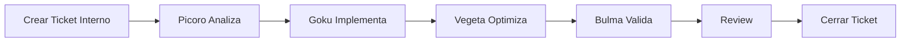

# AI SKILL DEVELOPMENT AND SPEC DRIVEN ASSISTANCE AI - Metodología Híbrida
## Sistema Multi-Proyecto con Agentes, Skills, Conocimientos, Especificaciones y Tickets

**Versión**: 1.0  
**Fecha**: 03 de Marzo 2026  
**Autor**: Dr. Francisco Ibarra Carlos  
**Nota**: Adaptación para el proyecto `pwa_inversions_drfic` — Plataforma de Inversiones con IA

---

## 1. Introducción

La metodología **AI SKILL DEVELOPMENT** y **SPEC DRIVEN ASSISTANCE AI** permite gestionar múltiples proyectos PWA de manera profesional, modular, reutilizable y trazable mediante:

- 🤖 **Agentes**: Entidades autónomas que ejecutan tareas
- 🎯 **Skills**: Capacidades reutilizables entre proyectos  
- 📚 **Knowledge**: Cuadernos de conocimiento local y remoto
- 🎫 **Tickets**: Control de cambios trazable
- 📋 **Specifications**: Especificaciones detalladas básica (inicial) e incrementales

---

## 2. Estructura del Folder ai_skill_dev1

```
ai_skill_dev1/
├── ai_global/                              # Recursos globales reutilizables
|   ├── AI_SKILL_DEVELOPMENT_METHODOLOGY.md # Este documento
│   ├── agents/                             # 🤖 Agentes de IA de Desarrollo
│   │   ├── README.md
│   │   ├── fic_picoro_agent_orchestrator.md
│   │   ├── fic_goku_agent_dev1.md
│   │   ├── fic_vegeta_agent_dev2.md
│   │   └── fic_bulma_agent_tester1.md
│   │
│   ├── skills/                      # 🎯 Skills de IA (documentación)
│   │   ├── README.md                # 🛠️ Índice de skills (habilidades)
│   ├── knowledge/                   # 📚 Conocimiento global
│   │   ├── README.md
│   │   ├── remote/                  # Enlaces externos
│   │   │   ├── README.md            # 🧠 Índice de conocimientos online
│   │   │   └── *.md
│   │   └── local/                   # Conocimiento interno
│   │       ├── README.md            # 🧠 Índice de conocimientos local
│   │       └── *.md
│   │
│   ├── templates/                   # 📋 Templates
│   │   ├── AGENT_TEMPLATE.md
│   │   ├── SKILL_TEMPLATE.md
│   │   ├── TICKET_TEMPLATE.md
│   │   ├── KNOWLEDGE_NOTE_TEMPLATE.md
│   │   ├── SPEC_INCREMENTAL_TEMPLATE.md
│   │   └── PROJECT_CONFIG_TEMPLATE.yaml
│   │
│   └── tickets/                           # 🎫 Tickets globales
│       ├── README.md
│       └── TKT-GLOBAL-###.md
│
├── packages/                    # Librerías compartidas (design system, utils, etc.)
│   ├── ui-library/              # Librería interna de componentes UI
│   │   ├── src/
│   │   ├── package.json
│   │   └── tsconfig.json
│   ├── utils/                   # Funciones utilitarias compartidas
│   │   ├── src/
│   │   ├── package.json
│   │   └── tsconfig.json
│   └── types/                   # Tipos globales compartidos
│       ├── src/
│       ├── package.json
│       └── tsconfig.json
|
└── projects/                              # Proyectos organizados por categoría
    ├── pwa/                               # Proyectos PWA
    │   ├── pwa_inversions_drfic/          # Proyecto: Plataforma de Inversiones IA
    │   │   ├── public/
    │   │   ├── src/                 # Aquí se define la estructura completa
    |   |   |   ├── ai_work_flow/           # ✅ Estructura metodológica del proyecto
    │   │   │   |   ├── development/        # Instrucciones para agentes
    │   |   │   │   │   ├── workflow_agents.yaml  # Tareas de Picoro/Goku/Vegeta/Bulma
    │   |   │   │   │   └── README.md
    │   |   │   │   ├── docs/               # Documentación funcional/técnica
    │   |   │   │   │   ├── specs/
    │   |   │   │   │   │   ├── SPECIFICATION.md
    │   |   │   │   │   │   └── incremental/
    │   |   │   │   │   ├── templates/
    │   |   │   │   │   └── scripts/
    │   |   │   │   ├── knowledge/
    │   |   │   │   │   ├── README.md
    │   |   │   │   │   ├── remote/
    │   |   │   │   │   └── local/
    │   |   │   │   └── tickets/            # Tickets internos de desarrollo
    │   |   │   │       ├── README.md
    │   |   │   │       ├── TKT-INVRFIC-001.md
    │   |   │   │       ├── TKT-INVRFIC-002.md
    │   |   │   │       └── ...
    │   │   │   ├── assets/          # Recursos estáticos (imágenes, fuentes, estilos globales)
    │   │   │   ├── components/      # Componentes reutilizables
    │   │   │   │   └── ui/          # Atomic design: atoms, molecules, organisms
    │   │   │   ├── features/        # Módulos funcionales
    │   │   │   │   ├── dashboard/           # Dashboard principal
    │   │   │   │   ├── market-scanner/      # Escáner de mercado
    │   │   │   │   ├── options-chain/       # Cadena de opciones
    │   │   │   │   ├── signals/             # Motor de señales
    │   │   │   │   ├── portfolio/           # Gestión de portafolio
    │   │   │   │   ├── broker-connect/      # Conexión con brokers
    │   │   │   │   ├── backtesting/         # Backtesting de estrategias
    │   │   │   │   └── alerts/              # Sistema de alertas
    │   │   │   ├── hooks/           # Hooks globales
    │   │   │   ├── layouts/         # Layouts generales
    │   │   │   ├── pages/           # Páginas principales
    │   │   │   ├── routes/          # Configuración de rutas
    │   │   │   ├── services/        # Servicios externos
    │   │   │   │   ├── broker/              # Integración con brokers (IBKR, etc.)
    │   │   │   │   ├── market-data/         # Feeds de datos (TradingView, etc.)
    │   │   │   │   ├── indicators/          # Motor de indicadores técnicos
    │   │   │   │   ├── ai-analysis/         # Análisis con IA (Claude API)
    │   │   │   │   └── news/                # Servicio de noticias financieras
    │   │   │   ├── store/           # Estado global (Zustand/Redux)
    │   │   │   ├── styles/          # Estilos globales
    │   │   │   ├── utils/           # Funciones utilitarias
    │   │   │   ├── types/           # Tipos globales
    │   │   │   ├── App.tsx          # Componente raíz
    │   │   │   ├── main.tsx         # Punto de entrada
    │   │   │   └── vite-env.d.ts    # Tipos generados por Vite
    │   │   ├── tests/               # Pruebas unitarias e integración
    │   │   │   └── e2e/             # Pruebas end-to-end
    │   │   ├── index.html
    │   │   ├── package.json
    │   │   ├── tsconfig.json
    │   │   └── vite.config.ts
```

### Convención de Código Fuente (SRC-First)

- Todo código React y TypeScript nuevo del proyecto se crea dentro de `src/`.
- Rutas válidas:
  - `packages/ui-library/src/...`
  - `packages/utils/src/...`
  - `packages/types/src/...`
  - `projects/pwa/pwa_inversions_drfic/src/...`
- `config.yaml` y `README.md` por componente son opcionales (modo Full), no obligatorios para ejecutar.
- Compatibilidad: proyectos ya existentes fuera de `src/` no se rompen; se migran gradualmente.

---

## 3. Componentes Core

### 3.1 🤖 Agentes (Agents)

**Definición**: Entidad autónoma que ejecuta tareas usando uno o más skills.

**Ubicación**:
- Globales: `ai_skill_dev1/ai_global/agents/`
- Proyecto específico (workflow): `ai_skill_dev1/projects/pwa/pwa_inversions_drfic/src/ai_work_flow/development/`
- Proyecto específico (código ejecutable): `ai_skill_dev1/projects/pwa/pwa_inversions_drfic/src/`

**Ejemplo de configuración de módulo de inversiones**:
```yaml
# config.yaml
name: market_scanner_agent
version: 1.0.0
description: Agente para escaneo de mercado y detección de señales de trading
skills_required:
  - broker_connector
  - technical_indicators
  - signal_detector
  - ai_market_analyzer
configuration:
  scan_interval_seconds: 60
  max_concurrent_symbols: 50
  signal_confidence_threshold: 0.75
```

#### 3.1.1 Agentes de Desarrollo (AI Skill Development)

Estos son **4 agentes de IA operativos** que trabajan juntos en el ciclo de desarrollo. No son usuarios, son entidades autónomas con skills específicos.

**Ubicación**: `ai_skill_dev1/ai_global/agents/` (archivos.md)

```
🧠 fic_picoro_agent_orchestrator
- Rol: Analista/Arquitecto/Orquestador
- Skills: ticket_analyzer, architecture_designer, requirement_validator, knowledge_synthesizer
- CUÁNDO: FASE 2.3 (Investigación) y FASE 2.4 (Diseño)
- Función: Analiza SPECIFICATION.md, diseña arquitectura financiera, genera config.yaml

👨‍💻 fic_goku_agent_dev1
- Rol: Programador Senior #1
- Skills: react_code_generator, typescript_code_generator, vite_code_generator,
          tradingview_widgets_integrator, broker_api_integrator, documentation_writer,
          dependency_manager, code_structure_organizer
- CUÁNDO: FASE 2.4 (Estructura) y FASE 3 (Implementación)
- Función: Implementa código Vite, React, TypeScript; servicios de brokers,
           indicadores técnicos, módulos de señales, integración con APIs financieras
- Estándar de documentación: comentarios inline con prefijo FIC en inglés y español

🥷 fic_vegeta_agent_dev2
- Rol: Optimizador/Desarrollador Senior #2
- Skills: code_optimizer, performance_analyzer, security_auditor, pattern_refactorer
- CUÁNDO: FASE 3 (durante/después de Goku)
- Función: Optimiza latencia en feeds de datos de mercado, audita seguridad de
           credenciales de broker, refactoriza patrones de gestión de riesgo

🧪 fic_bulma_agent_tester1
- Rol: QA Tester/Guardiana de Calidad
- Skills: test_case_generator, bug_detector, quality_validator, regression_tester
- CUÁNDO: FASE 3 (después de Goku/Vegeta)
- Función: Crea tests para estrategias de trading, valida cálculos de indicadores,
           verifica precisión de señales de compra/venta
```

**Ciclo Completo**:

```
┌─ FASE 2.3 (Investigación) ─────────────────────┐
│ Picoro: Investiga APIs financieras, brokers,   │
│         estrategias a implementar              │
│ Deliverable: Arquitectura documentada          │
└────────────────────────────────────────────────┘
                        ↓
┌─ FASE 2.4 (Estructura) ────────────────────────┐
│ Goku: Crea estructura base, skeletons de       │
│       features de inversión                    │
│ Deliverable: Proyecto estructurado             │
└────────────────────────────────────────────────┘
                        ↓
┌─ FASE 3.1 (Implementación) ────────────────────┐
│ Goku: Implementa servicios/módulos:            │
│  - broker_connector, market_data               │
│  - technical_indicators, signal_detector       │
│  - options_chain, backtesting_engine           │
│ Deliverable: Código funcional                  │
└────────────────────────────────────────────────┘
                        ↓
        ┌───────────────┬──────────────┐
        ↓               ↓
    ┌─ VEGETA ──────┐  ┌─ BULMA ──────┐
    │ Optimiza      │  │ Crea tests   │
    │ latencia feeds│  │ Valida       │
    │ Seguridad API │  │ cálculos     │
    │ credenciales  │  │ indicadores  │
    └───────────────┘  └──────────────┘
          ↓                    ↓
        ┌──────────────────────┐
        ↓
    ┌─ APROBACIÓN ─────────┐
    │ Cálculos correctos?  │
    │ Señales precisas?    │
    │ Seguridad OK?        │
    │ Bugs = 0?            │
    └──────────────────────┘
          ↓ SÍ
    [MÓDULO LISTO]
```

**Regla de Oro**: Orden es **Picoro → Goku → (Vegeta ∥ Bulma) → Aprobación** ✅

**Regla de Documentación Inline (Obligatoria)**:
- Todo archivo TypeScript/React implementado en FASE 3 debe incluir comentarios con prefijo `FIC`.
- Los comentarios `FIC` deben escribirse en inglés y español (EN/ES).
- Mínimo requerido: módulo, clases, hooks públicos, servicios de broker y bloques de lógica crítica de señales.
- La ausencia de este estándar bloquea el cierre del ticket hasta corregirse.

Ver: `development/workflow_agents.yaml` en cada proyecto para tareas específicas.

---

### 3.2 🎯 Skills de IA (Habilidades de Desarrollo)

**Definición**: Capacidades específicas de los agentes de IA para ejecutar tareas en el desarrollo.

**Skills de cada Agente**:
- **Picoro**: ticket_analyzer, architecture_designer, requirement_validator, knowledge_synthesizer
- **Goku**: react_code_generator, typescript_code_generator, vite_code_generator, tradingview_widgets_integrator, broker_api_integrator, documentation_writer, dependency_manager, code_structure_organizer
- **Vegeta**: code_optimizer, performance_analyzer, security_auditor, pattern_refactorer
- **Bulma**: test_case_generator, bug_detector, quality_validator, regression_tester

**NO confundir con**:
- **assets**: Recursos estáticos (logos brokers, íconos de instrumentos financieros) → `assets/<asset_name>.*`
- **components**: Componentes reutilizables de UI (CandlestickChart, IndicatorPanel) → `components/<component_name>.tsx`
- **ui**: Atomic design: atoms (Badge, Chip), molecules (SignalCard), organisms (WatchlistTable) → `components/ui/<ui_name>.tsx`
- **features**: Módulos funcionales de trading → `features/<feature_name>/`
- **hooks**: Hooks globales (useMarketData, useBrokerConnection) → `hooks/<hook_name>.tsx`
- **layouts**: Layouts generales (TradingLayout, DashboardLayout) → `layouts/<layout_name>.tsx`
- **pages**: Páginas principales (DashboardPage, SignalsPage) → `pages/<page_name>.tsx`
- **routes**: Configuración de rutas → `routes/<route_name>.tsx`
- **services**: Servicios externos (broker_connector, market_data_feed, ai_analysis) → `services/<service_name>.tsx`
- **store**: Estado global de mercado y portafolio → `store/<store_name>.tsx`
- **styles**: Estilos globales (tema dark trading) → `styles/<style_name>.tsx`
- **utils**: Funciones utilitarias (calcularRSI, formatearPrecio) → `utils/<util_name>.tsx`
- **types**: Tipos globales (Trade, Signal, Candle, OptionChain) → `types/<type_name>.tsx`

**Los skills de IA viven en**:
- `ai_global/skills/` como archivos `.md` independientes
- Se asignan a uno o más agentes en `ai_global/agents/*.md`
- Pueden ser extendidos por proyecto en `development/workflow_agents.yaml`

**Regla**: Un skill es reutilizable y puede ser asignado a múltiples agentes.

**Referencia**:
- Skills: [ai_global/skills/README.md](ai_global/skills/README.md)
- Agentes: [ai_global/agents/README.md](ai_global/agents/README.md)

#### 3.2.1 Registro de Skills (Locales y de Nube)

**Objetivo**: Mantener un catálogo único de skills de IA, sin importar si fueron creados por el equipo o descargados de la nube.

**Regla**: TODO skill nuevo se registra primero en `ai_global/skills/` antes de asignarse a agentes o proyectos.

**Pasos**:
1. Crear archivo `.md` del skill en `ai_global/skills/`.
2. Documentar: propósito, inputs/outputs, agentes compatibles, fuente (local o nube), versión y restricciones.
3. Asignar el skill en `ai_global/agents/<agente>.md`.
4. Si es por proyecto, agregar en `development/workflow_agents.yaml`.

**Skills de nube**:
- Se documentan igual que los skills locales.
- Se registra origen, versión, proveedor y forma de integración.
- Si requiere instalación (ej. librería TA-Lib, IBKR API), se documenta en el proyecto que lo use.

**Resultado**: Skills listos para ser asignados a uno o más agentes sin perder trazabilidad.

---

### 3.3 📚 Knowledge (Conocimiento)

**Definición**: Sistema híbrido de gestión de conocimiento que combina documentación local (.md) con referencias a fuentes externas y herramientas de IA en la nube.

**Principio Fundamental**: El conocimiento se genera ANTES de los tickets para informar las decisiones de implementación.

**Regla de Oro (Knowledge Base)**:
1. **Siempre** se consulta primero la base de conocimiento **GLOBAL** (`ai_global/knowledge/`).
2. **Luego** se aplica la base de conocimiento **DEL PROYECTO** (`projects/pwa/pwa_inversions_drfic/ai_work_flow/knowledge/`).
3. El conocimiento del proyecto **especializa** al global, no lo reemplaza.

---

#### 3.3.1 Knowledge Local (`knowledge/local/`)

**Propósito**: Conocimiento generado mediante investigación profunda realizada por IA durante la fase de planificación.

**Tipos de Contenido**:
- 🔍 Investigación técnica de APIs de brokers y feeds de datos de mercado
- 📊 Patrones de implementación de indicadores técnicos (RSI, MACD, Bollinger Bands)
- 🧠 Estrategias de opciones documentadas (Iron Condor, Straddle, Strangle, etc.)
- 💡 Decisiones arquitectónicas sobre integración con Interactive Brokers / TradingView
- 📝 Lecciones aprendidas durante el desarrollo de módulos de trading
- 🧪 Comparaciones de librerías de indicadores técnicos

**Ubicación**:
- Global: `ai_skill_dev1/ai_global/knowledge/local/`
- Proyecto: `ai_skill_dev1/projects/pwa/pwa_inversions_drfic/knowledge/local/`

**Convención de Nombres**:
```
01_<topic>_research.md         # Investigación numerada
02_<topic>_patterns.md         # Secuencia clara
03_<topic>_decisions.md        # Orden de lectura
04_<topic>_strategy.md         # Estrategia de implementación
lesson_<description>.md        # Lecciones aprendidas
examples/                      # Carpeta para ejemplos de código (opcional)
```

**Ejemplos de Código**:
El conocimiento local puede incluir código de tres formas:

1. **Snippets Embebidos** (< 30 líneas): Dentro de archivos .md de investigación
   ```markdown
   ## Patrón Recomendado: Conexión a Interactive Brokers
   ```typescript
   import { IBApi, EventName } from "@stoqey/ib";
   const ib = new IBApi({ port: 7497, clientId: 1 });
   ib.connect();
   ```
   ```

2. **Ejemplos Medianos** (30-100 líneas): En archivos .tsx dentro de `examples/`
   ```
   knowledge/local/examples/
   ├── README.md
   ├── ibkr_connection_demo.tsx
   ├── rsi_calculation_example.tsx
   ├── iron_condor_builder.tsx
   └── options_chain_parser.tsx
   ```

3. **Programas Completos**: Referenciados en `knowledge/remote/` (ver 3.3.2)

**Ejemplo — Investigación Técnica**:
```markdown
# 01_broker_api_research.md
## Investigación: Métodos de Conexión a Brokers con TypeScript

**Fecha**: 2026-03-03
**Investigador**: Claude AI (IA)
**Contexto**: Proyecto pwa_inversions_drfic

### Objetivo
Determinar el mejor método para conectar la aplicación a brokers certificados
para ejecutar operaciones y obtener datos de mercado en tiempo real.

### Opciones Investigadas

#### Opción 1: Interactive Brokers TWS API (@stoqey/ib)
**Descripción**: Librería Node.js oficial para la API de IBKR
**Pros**:
- ✅ API oficial y certificada de Interactive Brokers
- ✅ Acceso completo a opciones, acciones, futuros
- ✅ Datos en tiempo real L1 y L2
- ✅ Ejecución de órdenes algorítmicas

**Contras**:
- ❌ Requiere TWS o IB Gateway corriendo localmente
- ❌ Configuración inicial compleja

**Código Ejemplo**:
```typescript
import { IBApi, EventName, Contract } from "@stoqey/ib";
const ib = new IBApi({ port: 7497, clientId: 1, host: "127.0.0.1" });
ib.on(EventName.connected, () => console.log("Broker conectado"));
ib.connect();
```

#### Opción 2: Alpaca API (REST + WebSocket)
**Descripción**: API REST moderna para trading de acciones y opciones
**Pros**:
- ✅ REST y WebSocket nativos
- ✅ Paper trading gratuito para desarrollo
- ✅ Sin software adicional local

**Contras**:
- ❌ Menor profundidad de mercado que IBKR
- ❌ Opciones con funcionalidades limitadas vs IBKR

### Decisión Final
**Selección**: Interactive Brokers (@stoqey/ib) como broker primario + Alpaca para paper trading

**Razones**:
1. IBKR es el estándar de la industria para trading algorítmico profesional
2. Soporte completo para cadena de opciones y estrategias complejas
3. Alpaca facilita el desarrollo y testing sin capital real
4. Arquitectura modular permite cambiar de broker sin reescribir lógica

**Aplicación**:
- Usar en servicio: `broker_connector`
- Implementar en: TKT-INVRFIC-001, TKT-INVRFIC-002

### Referencias
- [IBKR API Docs](knowledge/remote/ibkr_api_reference.md)
- [Alpaca API Docs](knowledge/remote/alpaca_api_reference.md)
```

**Ejemplo — Lección Aprendida**:
```markdown
# lesson_options_chain_latency.md
## Lección: Latencia en Streaming de Cadena de Opciones

**Fecha**: 2026-03-10
**Contexto**: Durante desarrollo de TKT-INVRFIC-007
**Problema**: Suscribir a todos los strikes de la cadena de opciones generaba
              demasiado tráfico y la UI se congelaba

### Situación
Al suscribirse a actualizaciones de precio en tiempo real de todos los strikes
y expiraciones del SPY, se recibían >500 mensajes/seg saturando el estado de React.

### Solución Encontrada
```typescript
// FIC: Throttle updates to max 2/sec per strike (EN)
// FIC: Limitar actualizaciones a máx 2/seg por strike (ES)
const throttledUpdate = useMemo(() =>
  throttle((data: OptionQuote) => dispatch(updateOptionQuote(data)), 500),
  [dispatch]
);
```

### Aplicación
- Patrón reutilizable en: todos los streams de datos de mercado
- Documentado en: TKT-INVRFIC-007
```

---

#### 3.3.2 Knowledge Remote (`knowledge/remote/`)

**Propósito**: Referencias a fuentes externas, documentación oficial de brokers y APIs financieras, herramientas cloud de análisis, y código interno de referencia.

**Tipos de Contenido**:
- 🔗 URLs a documentación oficial de brokers (IBKR, Alpaca, TDAmeritrade)
- 📚 APIs de datos de mercado (TradingView, Polygon.io, Alpha Vantage)
- 🌐 Tutoriales de estrategias de opciones y análisis técnico
- ☁️ **NotebookLM** y otras herramientas de IA para investigación
- 📖 Estándares regulatorios (SEC, FINRA) relevantes
- 🏠 **Referencias internas** a código propio existente
- 📊 Recursos educativos de indicadores técnicos (RSI, MACD, Bollinger, etc.)

**Ubicación**:
- Global: `ai_skill_dev1/ai_global/knowledge/remote/`
- Proyecto: `ai_skill_dev1/projects/pwa/pwa_inversions_drfic/knowledge/remote/`

**Estructura de Archivo Remote**:
```markdown
# <topic>_reference.md
## [Título de la Fuente]

**Tipo**: Documentación Oficial / Tutorial / NotebookLM / API Reference / Otro
**URL**: <enlace directo>
**Fecha creación**: YYYY-MM-DD
**Última verificación**: YYYY-MM-DD
**Acceso**: Público / Requiere cuenta / Requiere API Key

### Resumen
[Breve descripción del contenido y su relevancia para el proyecto]

### Puntos Clave
- Endpoint o concepto importante 1
- Endpoint o concepto importante 2
- Limitaciones o rate limits relevantes

### Aplicación en Proyecto
[Cómo se aplica en pwa_inversions_drfic]

### Relacionado con
- Knowledge local: 01_topic_research.md
- Tickets: TKT-INVRFIC-001, TKT-INVRFIC-005
```

**Ejemplo — Documentación Oficial IBKR**:
```markdown
# ibkr_api_reference.md
## Interactive Brokers TWS API Documentation

**Tipo**: Documentación Oficial Interactive Brokers
**URL**: https://interactivebrokers.github.io/tws-api/
**Fecha creación**: 2026-03-03
**Última verificación**: 2026-03-03
**Acceso**: Público

### Resumen
Documentación oficial de la API de IBKR para conexión, obtención de datos
de mercado en tiempo real y ejecución de órdenes programáticas.

### Puntos Clave
- reqMktData(): Suscribirse a precios en tiempo real
- placeOrder(): Enviar órdenes de compra/venta
- reqOptionChain(): Obtener cadena de opciones
- reqHistoricalData(): Obtener velas históricas (OHLCV)
- Rate limits: 50 solicitudes de datos de mercado simultáneas (cuenta básica)

### Aplicación en Proyecto
Base técnica para implementación del servicio `broker_connector`
y el módulo `options_chain` en pwa_inversions_drfic.

### Relacionado con
- Knowledge local: 01_broker_api_research.md
- Tickets: TKT-INVRFIC-001 (Broker Connection), TKT-INVRFIC-007 (Options Chain)
```

**Ejemplo — TradingView Widgets**:
```markdown
# tradingview_widgets_reference.md
## TradingView Lightweight Charts & Widgets

**Tipo**: Documentación Oficial / Librería Open Source
**URL**: https://tradingview.github.io/lightweight-charts/
**Fecha creación**: 2026-03-03
**Última verificación**: 2026-03-03
**Acceso**: Público (MIT License)

### Resumen
Librería oficial de TradingView para renderizar gráficas financieras de alto
rendimiento en aplicaciones web: velas japonesas, líneas, indicadores superpuestos.

### Puntos Clave
- createChart(): Inicializa chart container con opciones de tema
- addCandlestickSeries(): Agrega serie de velas OHLCV
- addLineSeries(): Agrega indicadores como SMA, EMA, Bollinger
- update() en tiempo real: Actualiza última vela sin re-render completo
- Soporte nativo para tema oscuro (ideal para plataformas de trading)

### Aplicación en Proyecto
Principal librería de visualización para el módulo `market-scanner`
y las páginas de detalle de símbolo en pwa_inversions_drfic.

### Relacionado con
- Knowledge local: 02_charting_patterns.md
- Tickets: TKT-INVRFIC-003 (Charting Module)
```

**Ejemplo — NotebookLM**:
```markdown
# notebooklm_main_research.md
## NotebookLM: Investigación Profunda Proyecto pwa_inversions_drfic

**Tipo**: NotebookLM (Google AI)
**URL**: https://notebooklm.google.com/notebook/<id_del_notebook>
**Fecha creación**: 2026-03-03
**Última actualización**: 2026-03-03
**Acceso**: Requiere cuenta de Google (fibarrac@elnayar.com)

### Descripción
Notebook de investigación con análisis profundo de todos los documentos del
proyecto de inversiones usando IA de Google.

### Fuentes Subidas a NotebookLM
- ✅ SPECIFICATION.md (especificación completa del proyecto)
- ✅ Knowledge local generado (01_*.md a 05_*.md)
- ✅ Documentación de IBKR API
- ✅ Documentación de TradingView Lightweight Charts
- ✅ Referencias de estrategias de opciones (Iron Condor, Straddle, etc.)

### Capacidades de Este Notebook
- 💬 Responde preguntas sobre el proyecto de inversiones
- 📊 Genera resúmenes de estrategias de opciones
- 🔍 Encuentra inconsistencias entre documentos de requerimientos
- 💡 Sugiere mejoras en la lógica de señales de trading
- 📝 Crea guías para implementación de indicadores

### Preguntas Clave Ya Respondidas
1. **¿Qué indicadores combinar para generar señales de mayor confianza?**
   - Respuesta: RSI(14) + MACD(12,26,9) + Bollinger Bands(20,2) como confirmación triple
   
2. **¿Cómo detectar cuándo los institucionales están posicionados?**
   - Respuesta: Analizar Open Interest + Volume en opciones ATM y analizar dark pool prints

3. **¿Cuál es la mejor frecuencia de actualización para el scanner?**
   - Respuesta: 1 minuto para señales intraday, 15 min para swing trading

### Hallazgos Adicionales del Análisis IA
[El usuario copia aquí los insights importantes que NotebookLM genere durante el desarrollo]

### Cómo Usar Este Notebook
1. Acceder al URL con cuenta autorizada
2. Hacer preguntas específicas durante el desarrollo de cada módulo
3. Consultar antes de tomar decisiones sobre lógica de señales
4. Actualizar con nuevo conocimiento generado durante el desarrollo

### Relacionado con
- Proyecto: pwa_inversions_drfic
- Knowledge local: todos los archivos 01_*.md a 05_*.md
- Todos los tickets (contexto general)
```

---

#### 3.3.3 Flujo de Generación de Conocimiento

**Momento**: ANTES de generar tickets (parte de FASE 2.3)

**Proceso**:

```
┌─────────────────────────────────────────────────────┐
│ PASO 1: IA Analiza SPECIFICATION.md                 │
└─────────────────────────────────────────────────────┘
                        ↓
         Identifica áreas que requieren investigación:
         - APIs de brokers a integrar (IBKR, Alpaca)
         - Librerías de indicadores técnicos
         - Estrategias de opciones a implementar
         - Fuentes de datos de mercado y noticias

┌─────────────────────────────────────────────────────┐
│ PASO 2: IA Genera Knowledge Local (.md)             │
└─────────────────────────────────────────────────────┘
                        ↓
         knowledge/local/
         ├── 01_broker_api_research.md
         ├── 02_charting_library_research.md
         ├── 03_technical_indicators_patterns.md
         ├── 04_options_strategies_decisions.md
         └── 05_ai_signal_analysis_strategy.md

┌─────────────────────────────────────────────────────┐
│ PASO 3: IA Genera Knowledge Remote (.md)            │
└─────────────────────────────────────────────────────┘
                        ↓
         knowledge/remote/
         ├── ibkr_api_reference.md
         ├── alpaca_api_reference.md
         ├── tradingview_widgets_reference.md
         ├── polygon_io_market_data.md
         ├── talib_indicators_reference.md
         └── notebooklm_placeholder.md  (usuario completa)

┌─────────────────────────────────────────────────────┐
│ PASO 4: Usuario Crea NotebookLM (Opcional)          │
└─────────────────────────────────────────────────────┘
                        ↓
         1. Accede a notebooklm.google.com
         2. Crea notebook del proyecto de inversiones
         3. Sube: SPECIFICATION.md + knowledge local + docs de APIs
         4. Hace preguntas sobre estrategias y lógica de señales
         5. Obtiene URL del notebook

┌─────────────────────────────────────────────────────┐
│ PASO 5: Usuario Completa Remote Reference           │
└─────────────────────────────────────────────────────┘
                        ↓
         Actualiza knowledge/remote/notebooklm_*.md
         con URL y hallazgos clave de trading

┌─────────────────────────────────────────────────────┐
│ PASO 6: IA Genera Tickets (Usa Knowledge)           │
└─────────────────────────────────────────────────────┘
                        ↓
         Cada ticket referencia conocimiento necesario:
         
         # TKT-INVRFIC-001: Implementar Broker Connector
         ## Conocimiento Requerido
         - 📄 knowledge/local/01_broker_api_research.md
         - 🔗 knowledge/remote/ibkr_api_reference.md
         - ☁️ knowledge/remote/notebooklm_main.md
```

**Resultado**: Desarrollador tiene contexto completo de las APIs financieras y estrategias ANTES de codificar.

---

#### 3.3.4 Gestión Híbrida durante Desarrollo

**Durante FASE 3 (desarrollo de tickets)**:

1. **Desarrollador lee conocimiento**
   - Revisa local/ para entender decisiones de indicadores y estrategias
   - Consulta remote/ para referencias de APIs de brokers y librerías
   - Usa NotebookLM para preguntas específicas de lógica financiera

2. **Desarrollador implementa**
   - Sigue patrones documentados de conexión a broker
   - Aplica decisiones arquitectónicas de cálculo de indicadores
   - Implementa estrategias de opciones según especificación

3. **Desarrollador documenta lecciones**
   - Si encuentra latencia inesperada en feeds → crea `lesson_market_data_latency.md`
   - Si descubre comportamiento de API no documentado → actualiza knowledge
   - Si cambia librería de indicadores → documenta razón con benchmarks

**Beneficios**:
- ✅ Menos re-trabajo en lógica de señales
- ✅ Decisiones informadas sobre brokers y feeds de datos
- ✅ Conocimiento de estrategias financieras preservado
- ✅ Equipo alineado en métricas de riesgo y criterios de señales

---

#### 3.3.5 Estructura de README y Trazabilidad Temporal

**Propósito**: Cada carpeta `knowledge/` (raíz, local/, remote/) debe tener un README.md que proporciona:
1. **Estado Actual** visible para IA/metodología
2. **Historial de Estado** para auditoría temporal
3. **Métricas** de contenido generado

**Template**: [README_KNOWLEDGE_TEMPLATE.md](ai_global/templates/README_KNOWLEDGE_TEMPLATE.md)

**Estructura Estándar del README**:

```markdown
## 📋 Estado Actual

| Aspecto | Estado | Última Actualización |
|---------|--------|----------------------|
| **Investigación de Brokers** | ✅ Generado | 2026-03-03 10:00 |
| **Librerías de Indicadores** | ✅ Generado | 2026-03-03 10:00 |
| **Estrategias de Opciones** | ⏳ En proceso | 2026-03-03 12:30 |
| **Fase del Proyecto** | FASE 2 | - |

## 📊 Métricas de Conocimiento

| Métrica | Valor |
|---------|-------|
| Archivos de investigación (local) | 5 |
| Referencias externas (remote) | 9 |
| Tickets informados | 0 |
| Estrategias documentadas | 8 |

## 📅 Historial de Estado

| Fecha | Hora | Estado Anterior | Estado Nuevo | Evento | Notas |
|-------|------|-----------------|--------------|--------|-------|
| 2026-03-03 | 10:00 | 🚧 Estructura | ✅ Generado | Investigación brokers | 5 local + 9 remote |
| 2026-03-02 | 09:00 | - | 🚧 Estructura | Setup | Directorios creados |
```

**Principios del Historial**:
1. **Estado Actual arriba**: Para que IA pueda encontrar rápidamente la fase actual
2. **Historial completo abajo**: Para auditoría y análisis de progreso
3. **Fechas/horas precisas**: Permite análisis temporal
4. **Eventos descriptivos**: Contexto de qué pasó en cada cambio
5. **Notas con métricas**: Cantidad de archivos, decisiones de estrategias tomadas

**Convenciones de Estado**:
- 🚧 **Pendiente**: Trabajo no iniciado o estructura básica
- ✅ **Generado/Completado**: Trabajo finalizado y validado
- ⏳ **En proceso**: Trabajo activo en este momento
- ❌ **Bloqueado**: Trabajo detenido por dependencias

---

### 3.4 🎫 Tickets

**Convención de Nombres**:
- Global: `TKT-GLOBAL-###`
- Proyecto Inversiones: `TKT-INVRFIC-###`

**Estados**: Open → In Progress → Review → Closed

**Política de Cierre (Obligatoria)**:
- `Closed` (o ✅ Completado) SOLO se permite con evidencia de prueba.
- Evidencia mínima: resultado de tests (unitarios/integración o validación manual documentada), fecha, entorno y responsable.
- Para módulos de trading: incluir validación de cálculos de indicadores vs. fuente de referencia (ej. TradingView).
- Si el código está implementado pero sin validación ejecutada, el estado correcto es `Review`.
- Está prohibido cerrar tickets por "código terminado" sin ejecución comprobada.

**Estructura Mínima**:
```markdown
# TKT-INVRFIC-003: Implementar módulo de indicadores técnicos

## Metadata
- Tipo: Feature
- Prioridad: Alta
- Estado: In Progress
- Proyecto: pwa_inversions_drfic

## Descripción
Implementar cálculo de RSI(14), MACD(12,26,9) y Bollinger Bands(20,2)
sobre datos OHLCV en tiempo real.

## Archivos Afectados
- src/services/indicators/rsi.service.ts
- src/services/indicators/macd.service.ts
- src/services/indicators/bollinger.service.ts

## Trazabilidad
- Relacionado: TKT-GLOBAL-005 (skill global de cálculo de indicadores)
- Knowledge: knowledge/local/03_technical_indicators_patterns.md
```

---

## 4. Flujo de Trabajo Estándar

### 4.1 Crear Nuevo Proyecto

```bash
# Paso 0 (FASE 1): Definir skills globales
# Crear/registrar skills en ai_skill_dev1/ai_global/skills/*.md
# Asignar skills base en ai_global/agents/*.md

# Paso 1: Crear estructura del proyecto
ai_skill_dev1/projects/pwa/pwa_inversions_drfic/
├── README.md
├── config.yaml
├── src/
│   └── ai_work_flow/
│       ├── development/
│       │   ├── workflow_agents.yaml
│       │   └── README.md
│       ├── docs/
│       │   └── specs/
│       │       ├── SPECIFICATION.md
│       │       └── incremental/
│       ├── knowledge/
│       │   ├── remote/
│       │   └── local/
│       └── tickets/
├── tests/
└── docs/

# Paso 2: Configurar proyecto
# Editar config.yaml con metadata del proyecto de inversiones

# Paso 3: Asignar skills por proyecto
# Editar development/workflow_agents.yaml
# (Si hay skills nuevos: broker_api_integrator, options_analyzer, etc.,
#  documentarlos en ai_global/skills/*.md)

# Paso 4: Crear ticket inicial
TKT-INVRFIC-001: Setup inicial + Broker Connector

# Paso 5: Desarrollar
# Implementar en features/ y services/
# Documentar decisiones de indicadores/estrategias en knowledge/local/
```

#### 4.1.1 Checklist de Inicio de Proyecto (FASE 2.1-2.4)

- [ ] SPECIFICATION.md creado y validado
- [ ] Skills globales documentados en `ai_global/skills/`
- [ ] Skills asignados en `ai_global/agents/*.md`
- [ ] `development/workflow_agents.yaml` creado con tareas por agente
- [ ] `features/` y `services/` definidos con sus `config.yaml`
- [ ] Knowledge base inicial creada (`knowledge/local` y `knowledge/remote`)
  - [ ] Investigación de brokers documentada
  - [ ] Librerías de indicadores técnicos comparadas
  - [ ] Estrategias de opciones especificadas
- [ ] Ticket inicial creado (`TKT-INVRFIC-001`)

---

### 4.2 Desarrollo Guiado por Tickets

#### 4.2.1 Tipos de Tickets

**A. Ticket Externo** (del usuario/cliente):
- **Origen**: Usuario final, Product Owner, Trader/Inversionista
- **Ejemplos**: REQ-INV-001: "Necesito señales de compra de opciones en SPY basadas en RSI"
- **Qué contiene**: Solicitud de negocio (nuevo módulo, estrategia, mejora)
- **Quién lo procesa**: TÚ (el desarrollador)

**B. Specification (SPEC)**:
- **Origen**: Traducción técnica del ticket externo
- **Quién lo crea**: TÚ (desarrollador)
- **Base**: SPECIFICATION.md (original) o incremental/SPEC_00X.md (cambios grandes)

**C. Tickets Internos de Desarrollo**:
- **Origen**: Derivados del diseño de Picoro
- **Formato**: `TKT-INVRFIC-###`
- **Quién los crea**: TÚ (basándote en workflow_agents.yaml)
- **Qué contienen**: Tarea específica de implementación

---

#### 4.2.2 Flujo de Tickets: Proyecto Nuevo vs Cambios

**ESCENARIO 1: Proyecto NUEVO desde cero**

```
Ticket Externo: REQ-INV-001
"Necesito una plataforma web que detecte señales de trading
 con RSI, MACD y Bollinger, integrada con IBKR"
    ↓
TÚ creas: docs/specs/SPECIFICATION.md
    ↓
Picoro investiga → knowledge/local/*.md
  (brokers, indicadores, estrategias, feeds de datos)
Picoro diseña → workflow_agents.yaml + config.yaml
    ↓
TÚ creas tickets internos:
    - TKT-INVRFIC-001: Implementar broker_connector (IBKR)
    - TKT-INVRFIC-002: Implementar market_data_feed
    - TKT-INVRFIC-003: Implementar technical_indicators service
    - TKT-INVRFIC-004: Implementar signal_detector engine
    - TKT-INVRFIC-005: Implementar dashboard UI
    - TKT-INVRFIC-006: Implementar options_chain viewer
    - TKT-INVRFIC-007: Implementar alerts system
    - ...
    ↓
Por cada ticket: Picoro → Goku → Vegeta → Bulma
    ↓
Cierras ticket externo REQ-INV-001
```

**ESCENARIO 2: Proyecto EXISTENTE - Cambio PEQUEÑO**

```
Ticket Externo: REQ-INV-015
"Agregar el indicador ATR al scanner de mercado"
    ↓
TÚ creas DIRECTAMENTE ticket interno:

tickets/TKT-INVRFIC-025.md
---
Ticket Externo: REQ-INV-015
Solicitante: Dr. FIC
Tipo: Mejora

Descripción: Agregar Average True Range (ATR) como indicador de volatilidad
             al servicio de indicadores técnicos y al scanner.
Archivos Afectados:
- src/services/indicators/atr.service.ts
- src/features/market-scanner/components/ScannerRow.tsx
    ↓
Picoro → Goku → Vegeta → Bulma
    ↓
Cierras ticket externo REQ-INV-015
```

**ESCENARIO 3: Proyecto EXISTENTE - Cambio GRANDE**

```
Ticket Externo: REQ-INV-030
"Agregar módulo completo de backtesting para estrategias de opciones"
    ↓
TÚ creas especificación incremental:

docs/specs/incremental/SPEC_002_backtesting_module.md
---
Ticket Externo: REQ-INV-030
Relacionado con: SPECIFICATION.md (original)

Nueva Funcionalidad: Motor de backtesting para Iron Condor, Straddle, Strangle
Fuente de datos históricos: Polygon.io / CBOE
...
    ↓
Picoro analiza spec incremental
Picoro diseña → actualiza workflow_agents.yaml
    ↓
TÚ creas nuevos tickets internos:
    - TKT-INVRFIC-040: Integrar histórico de opciones (Polygon.io)
    - TKT-INVRFIC-041: Motor de backtesting para estrategias
    - TKT-INVRFIC-042: Dashboard de resultados de backtesting
    - TKT-INVRFIC-043: Métricas de rendimiento (Sharpe, Max Drawdown)
    - ...
    ↓
Por cada ticket: Picoro → Goku → Vegeta → Bulma
    ↓
Cierras ticket externo REQ-INV-030
```

---

#### 4.2.3 Regla de Decisión: ¿Cuándo crear nueva SPEC?

| Tipo de Cambio | ¿Nueva SPECIFICATION? | ¿Qué crear? |
|----------------|----------------------|-------------|
| **Proyecto nuevo** | ✅ SÍ | `docs/specs/SPECIFICATION.md` completo |
| **Fix de cálculo de indicador** | ❌ NO | Ticket interno directo |
| **Nuevo indicador técnico** | ❌ NO | Ticket interno directo |
| **Nueva estrategia de opciones GRANDE** | ✅ SÍ | `docs/specs/incremental/SPEC_00X.md` |
| **Módulo de backtesting** | ✅ SÍ | `docs/specs/incremental/SPEC_00X.md` |
| **Nuevo broker a integrar** | ✅ SÍ | `docs/specs/incremental/SPEC_00X.md` |
| **Refactoring completo de señales** | ⚠️ DEPENDE | Evaluar alcance del cambio |

**Criterios para "Cambio GRANDE"**:
- Requiere nuevos servicios/módulos (ej. backtesting engine, paper trading)
- Cambia arquitectura de datos de mercado
- Integra nuevo broker o nueva fuente de datos
- Estimación > 20 horas de desarrollo
- Necesita nueva investigación de APIs o estrategias financieras

---

#### 4.2.4 Estructura de Ticket Interno (con referencia externa)

```markdown
# TKT-INVRFIC-###: <Título>

**Metadata**:
- **Ticket Externo**: REQ-INV-XXXX (si aplica)
- **Solicitante**: Nombre (Área / Trader)
- **Fecha Solicitud**: YYYY-MM-DD
- **Tipo**: Nuevo Módulo / Estrategia / Indicador / Mejora / Corrección / Refactoring
- **Prioridad**: Alta / Media / Baja
- **Estado**: 🟡 En Desarrollo / ✅ Completado
- **Relacionado con**: SPECIFICATION.md o incremental/SPEC_00X.md

---

## Descripción del Cambio
[Qué se necesita implementar: indicador, estrategia, integración con broker, etc.]

**Justificación**: [Por qué es necesario para la estrategia de inversión]

---

## Análisis de Impacto

**Archivos a Modificar/Crear**:
- `src/services/indicators/<indicador>.service.ts`
- `src/features/<feature>/components/<Component>.tsx`
- `src/store/<store_slice>.ts`

**Estimación**: X horas

---

## Implementación

### Picoro analiza:
- [ ] Ticket revisado
- [ ] Impacto en lógica de señales identificado
- [ ] Plan aprobado

### Goku implementa:
- [ ] Código implementado (TypeScript/React)
- [ ] Comentarios FIC en inglés/español
- [ ] Integración con broker verificada (si aplica)

### Vegeta optimiza:
- [ ] Latencia de feed de datos revisada (si aplica)
- [ ] Seguridad de credenciales de broker auditada (si aplica)

### Bulma valida:
- [ ] Tests unitarios creados/actualizados
- [ ] Cálculos de indicador validados vs. TradingView (si aplica)
- [ ] Señales de trading verificadas con datos históricos

---

## Criterios de Aceptación

- [ ] Indicador/estrategia calculado correctamente
- [ ] Señal generada con nivel de confianza correcto
- [ ] Tests pasan (cobertura >80%)
- [ ] Validación manual en paper trading (si aplica)

---

## Cierre

**Fecha Cierre**: YYYY-MM-DD
**Commit**: `tipo(scope): descripción (#TKT-INVRFIC-###)`
**Ticket Externo Cerrado**: REQ-INV-XXXX ✅
```

---

#### 4.2.5 Workflow de Desarrollo por Ticket



1. **Crear Ticket Interno**: Basado en diseño de Picoro o necesidad del trader
2. **Picoro Analiza**: Confirma plan técnico, identifica impacto en señales/estrategias
3. **Goku Implementa**: Escribe código TypeScript/React, integra APIs financieras
4. **Vegeta Optimiza**: Revisa latencia de datos de mercado, seguridad de API keys
5. **Bulma Valida**: Crea tests, valida cálculos de indicadores, prueba señales
6. **Review**: Aprobación de código y lógica financiera
7. **Cerrar**: Marcar ticket como completado con evidencia

#### 4.2.6 Checklist por Ticket (FASE 3)

- [ ] Ticket definido con alcance claro
- [ ] Ticket externo referenciado (si aplica)
- [ ] Picoro analiza y define plan técnico/financiero
- [ ] Skills necesarios confirmados o agregados
- [ ] Goku implementa y documenta (comentarios FIC obligatorios)
- [ ] Vegeta optimiza (latencia, seguridad, si aplica)
- [ ] Bulma crea tests y valida cálculos financieros
- [ ] Evidencia de pruebas adjunta (incluyendo validación vs. TradingView si aplica)
- [ ] Ticket cerrado con aprobación
- [ ] Ticket externo cerrado (si aplica)

---

### 4.3 Gestión de Conocimiento

**Cuándo crear una nota de conocimiento**:
- ✅ Solución a problema complejo de latencia en feeds de datos descubierta
- ✅ Regla de negocio o criterio de señal de trading importante documentada
- ✅ Patrón reutilizable de integración con broker identificado
- ✅ Comportamiento inesperado de API de broker documentado

**Proceso**:
1. Crear en `knowledge/local/` (interno) o `knowledge/remote/` (referencia externa)
2. Usar template `KNOWLEDGE_NOTE_TEMPLATE.md`
3. Vincular desde README o tickets relevantes
4. Tagear con keywords: `RSI`, `MACD`, `options`, `IBKR`, `signal`, etc.

---

## 5. Convenciones

### 5.1 Nomenclatura

| Elemento | Formato | Ejemplo |
|----------|---------|---------|
| Proyecto | `pwa_<nombre>_<autor>` | `pwa_inversions_drfic` |
| Agente | `fic_<nombre>_agent` | `fic_goku_agent_dev1` |
| Skill | `<dominio>_<acción>` | `broker_connector`, `signal_detector`, `options_analyzer` |
| Ticket | `TKT-INVRFIC-###` | `TKT-INVRFIC-001` |
| Knowledge | `<tipo>_<tema>.md` | `lesson_options_chain_latency.md`, `ref_ibkr_api.md` |

### 5.2 Archivos de Configuración

#### config.yaml (Proyecto - Nivel Raíz)
```yaml
project:
  code: pwa_inversions_drfic
  name: Investment Platform AI
  version: 1.0.0
  category: pwa
  description: Plataforma de inversiones con detección de señales por IA,
               análisis técnico y gestión de estrategias de opciones

agents_involved:
  - fic_picoro_agent_orchestrator    # FASE 2.3-2.4
  - fic_goku_agent_dev1              # FASE 2.4-3
  - fic_vegeta_agent_dev2            # FASE 3
  - fic_bulma_agent_tester1          # FASE 3

tech_stack:
  frontend: React + TypeScript + Vite
  charting: TradingView Lightweight Charts
  state_management: Zustand
  styling: TailwindCSS (dark theme)
  broker_primary: Interactive Brokers (IBKR)
  broker_secondary: Alpaca (paper trading)
  market_data: Polygon.io / TradingView
  ai_analysis: Claude API (Anthropic)
  indicators_lib: technicalindicators (npm)

metadata:
  owner: Dr.FIC. Francisco Ibarra Carlos
  created: 2026-03-03
  last_updated: 2026-03-03
```

#### development/workflow_agents.yaml
```yaml
# Define tareas ESPECÍFICAS para agentes en el proyecto de inversiones
agents_tasks:
  picoro:
    - task_id: PICORO_001
      name: Analizar SPECIFICATION.md del proyecto de inversiones
      description: Investigación profunda de APIs financieras, estrategias y arquitectura
      inputs: SPECIFICATION.md, knowledge/
      outputs: Arquitectura diseñada, config.yaml, lista de servicios/features

  goku:
    - task_id: GOKU_001
      name: Implementar broker_connector service (IBKR)
      description: Conexión a Interactive Brokers TWS API
      inputs: config.yaml, knowledge/local/01_broker_api_research.md
      outputs: src/services/broker/ibkr.connector.ts

    - task_id: GOKU_002
      name: Implementar technical_indicators service
      description: RSI, MACD, Bollinger Bands, ATR sobre datos OHLCV
      inputs: config.yaml, knowledge/local/03_technical_indicators_patterns.md
      outputs: src/services/indicators/*.service.ts

    - task_id: GOKU_003
      name: Implementar signal_detector engine
      description: Motor de detección de señales de compra/venta
      inputs: Servicios de indicadores, knowledge/local/04_options_strategies_decisions.md
      outputs: src/services/signals/signal_detector.service.ts

    - task_id: GOKU_004
      name: Implementar dashboard UI principal
      description: Vista principal con watchlist, señales y gráficas
      inputs: TradingView widgets, store global
      outputs: src/features/dashboard/

  vegeta:
    - task_id: VEGETA_001
      name: Optimizar latencia de market data feed
      description: Asegurar actualizaciones <100ms en señales críticas
      inputs: Código final de Goku (servicios de datos)
      outputs: Código optimizado con throttling/debouncing

    - task_id: VEGETA_002
      name: Auditar seguridad de API keys y credenciales de broker
      description: Verificar que ninguna credencial quede expuesta en cliente
      inputs: Código completo del proyecto
      outputs: Reporte de seguridad + código corregido

  bulma:
    - task_id: BULMA_001
      name: Tests unitarios de indicadores técnicos
      description: Validar RSI, MACD, BB contra datos de referencia de TradingView
      inputs: src/services/indicators/*.service.ts
      outputs: tests/indicators/*.test.ts

    - task_id: BULMA_002
      name: Tests del motor de señales
      description: Validar precisión de señales con datos históricos conocidos
      inputs: src/services/signals/signal_detector.service.ts
      outputs: tests/signals/*.test.ts

execution_order: picoro → goku → (vegeta ∥ bulma) → final_review
```

#### features/`<feature>`/config.yaml
```yaml
feature:
  name: market_scanner
  description: Escáner de mercado en tiempo real con detección de señales

services_required:
  - broker_connector
  - market_data_feed
  - technical_indicators
  - signal_detector
  - ai_market_analyzer

workflow:
  - step1: broker_connector.subscribeMarketData(symbols)
  - step2: market_data_feed.streamOHLCV()
  - step3: technical_indicators.calculate(RSI, MACD, BB)
  - step4: signal_detector.analyze(indicators)
  - step5: ai_market_analyzer.confirm(signal)
  - step6: alerts.notify(confirmedSignal)
```

#### services/`<service>`/config.yaml
```yaml
service:
  name: technical_indicators
  version: 1.0.0
  description: Servicio de cálculo de indicadores técnicos en tiempo real

dependencies:
  - technicalindicators@3.x
  - ta-lib (opcional, para cálculos avanzados)

inputs:
  - symbol: string           # Ej: "SPY", "AAPL"
  - period: string           # Ej: "1m", "5m", "1h", "1d"
  - ohlcv: OHLCV[]           # Array de velas históricas

outputs:
  - rsi: number              # RSI(14) actual
  - macd: MACDResult         # MACD line, signal line, histogram
  - bollingerBands: BBResult # Upper, middle, lower bands
  - atr: number              # ATR(14) actual

error_handling:
  - insufficient_data: "Mínimo 30 velas requeridas para cálculo confiable"
  - stale_data_threshold_seconds: 60
  - fail_mode: return_null_with_warning
```

---

## 6. Integración entre Componentes

### 6.1 Usar Servicios en un Feature

```typescript
// En src/features/market-scanner/hooks/useMarketScanner.ts

// FIC: Import trading services for market analysis (EN)
// FIC: Importar servicios de trading para análisis de mercado (ES)
import { useBrokerConnection } from "@/services/broker/useBrokerConnection";
import { useTechnicalIndicators } from "@/services/indicators/useTechnicalIndicators";
import { useSignalDetector } from "@/services/signals/useSignalDetector";

export const useMarketScanner = (symbols: string[]) => {
  const { subscribeMarketData } = useBrokerConnection();
  const { calculateIndicators } = useTechnicalIndicators();
  const { detectSignals } = useSignalDetector();

  // FIC: Core scanning logic - combines data feed + indicators + signals (EN)
  // FIC: Lógica principal del scanner - combina feed + indicadores + señales (ES)
  const scanMarket = async () => {
    const data = await subscribeMarketData(symbols);
    const indicators = calculateIndicators(data);
    return detectSignals(indicators);
  };

  return { scanMarket };
};
```

### 6.2 Referenciar Knowledge Global

```markdown
<!-- En un README de feature del proyecto de inversiones -->

## Recursos de Conocimiento

### Knowledge Global
- [Indicadores Técnicos](../../ai_global/knowledge/local/technical_indicators_guide.md)
- [Brokers Certificados](../../ai_global/knowledge/remote/brokers_reference.md)

### Knowledge del Proyecto
- [Decisiones de Broker](knowledge/local/01_broker_api_research.md)
- [Estrategias de Opciones](knowledge/local/04_options_strategies_decisions.md)
- [Lecciones Aprendidas](knowledge/local/lesson_options_chain_latency.md)
```

---

## 7. Checklist: Empezar con la Metodología

- [ ] 1. Leer este documento completo
- [ ] 2. Revisar estructura de `ai_skill_dev1/`
- [ ] 3. Explorar templates en `ai_global/templates/`
- [ ] 4. Revisar proyecto ejemplo de referencia en `projects/pwa/`
- [ ] 5. Identificar qué skills globales necesitas (broker, indicators, signals)
- [ ] 6. Crear estructura de `pwa_inversions_drfic/`
- [ ] 7. Configurar `config.yaml` del proyecto con tech stack de inversiones
- [ ] 8. Generar knowledge base inicial (brokers, indicadores, estrategias)
- [ ] 9. Crear ticket inicial `TKT-INVRFIC-001`
- [ ] 10. Comenzar desarrollo por módulo (broker → data → indicadores → señales → UI)
- [ ] 11. Documentar aprendizajes de APIs financieras en `knowledge/local/`

---

## 8. Preguntas Frecuentes

**P: ¿Cuándo crear un skill global vs. local?**  
R: Global si es reutilizable en múltiples proyectos (ej. `broker_connector` podría usarse en otro proyecto de trading). Local si es muy específico de `pwa_inversions_drfic` (ej. una estrategia de señales propia).

**P: ¿Debo crear siempre agentes?**  
R: No es obligatorio. Los agentes son útiles para orquestar flujos complejos como el pipeline de señales: market_data → indicators → signal_detector → AI_analyzer → alerts.

**P: ¿Qué va en knowledge/remote vs local?**  
R: Remote son referencias externas (docs de IBKR, TradingView, Polygon.io). Local es conocimiento generado internamente (investigación de decisiones, lecciones aprendidas, patrones de implementación).

**P: ¿Cómo versiono mis skills?**  
R: Usa SemVer en `config.yaml`. Major.Minor.Patch (ej. 2.1.3).

**P: ¿Cómo valido que un indicador técnico está bien calculado?**  
R: Usa TradingView Pine Script como referencia. Ejecuta el mismo cálculo sobre los mismos datos históricos y compara resultados. Documenta la validación en el ticket de cierre.

**P: ¿Cómo manejo las API keys de brokers de forma segura?**  
R: Nunca en código fuente ni en archivos de conocimiento. Usar variables de entorno (`.env`) y documentar en `knowledge/local/` solo la estructura esperada (sin valores reales). Vegeta audita esto en cada módulo de broker.

---

## 9. Recursos del Proyecto de Inversiones

### Documentación de Referencia (Remote Knowledge)
- **IBKR TWS API**: https://interactivebrokers.github.io/tws-api/
- **Alpaca API**: https://docs.alpaca.markets/
- **TradingView Lightweight Charts**: https://tradingview.github.io/lightweight-charts/
- **Polygon.io Market Data**: https://polygon.io/docs/
- **technicalindicators (npm)**: https://github.com/anandanand84/technicalindicators

### Herramientas de Validación
- **TradingView**: Validación visual de indicadores y señales
- **Interactive Brokers Paper Account**: Testing de órdenes sin capital real
- **Alpaca Paper Trading**: Backtesting y testing de señales

### Templates del Proyecto
- **Templates**: `ai_skill_dev1/ai_global/templates/`
- **Skills Globales**: `ai_skill_dev1/ai_global/skills/`
- **Knowledge Global**: `ai_skill_dev1/ai_global/knowledge/`

---

**Última actualización**: 2026-03-03 (v1.0 — Adaptación para pwa_inversions_drfic)  
**Status**: ✅ Adaptado para proyecto de inversiones  
**Cambios principales respecto a versión RPA**:
- ✅ Estructura de proyecto adaptada a features de trading (scanner, signals, options, backtesting)
- ✅ Ejemplos de agentes orientados a APIs de brokers e indicadores financieros
- ✅ Skills de Goku extendidos con `tradingview_widgets_integrator` y `broker_api_integrator`
- ✅ Knowledge base con referencias a IBKR, TradingView, Polygon.io, etc.
- ✅ Tickets ejemplificados con lógica de inversiones (indicadores, señales, opciones)
- ✅ config.yaml con tech stack de la plataforma de inversiones
- ✅ workflow_agents.yaml con tareas específicas de trading
- ✅ Convención de nomenclatura `TKT-INVRFIC-###`
- ✅ FAQ ampliada con preguntas específicas de APIs financieras y seguridad de credenciales

**Referencias actualizadas**:
- Agentes: [ai_global/agents/README.md](ai_global/agents/README.md)
- Nomenclatura: [_drfic_ai_skill_dev_teaching/NAMING_STANDARDS.md](_drfic_ai_skill_dev_teaching/NAMING_STANDARDS.md)
- Guía rápida: [_drfic_ai_skill_dev_teaching/QUICK_START_GUIDE.md](_drfic_ai_skill_dev_teaching/QUICK_START_GUIDE.md)
